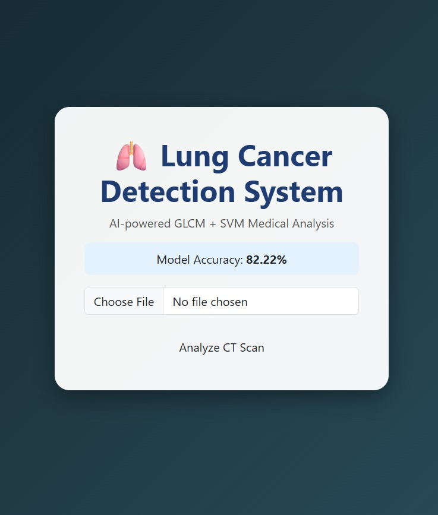
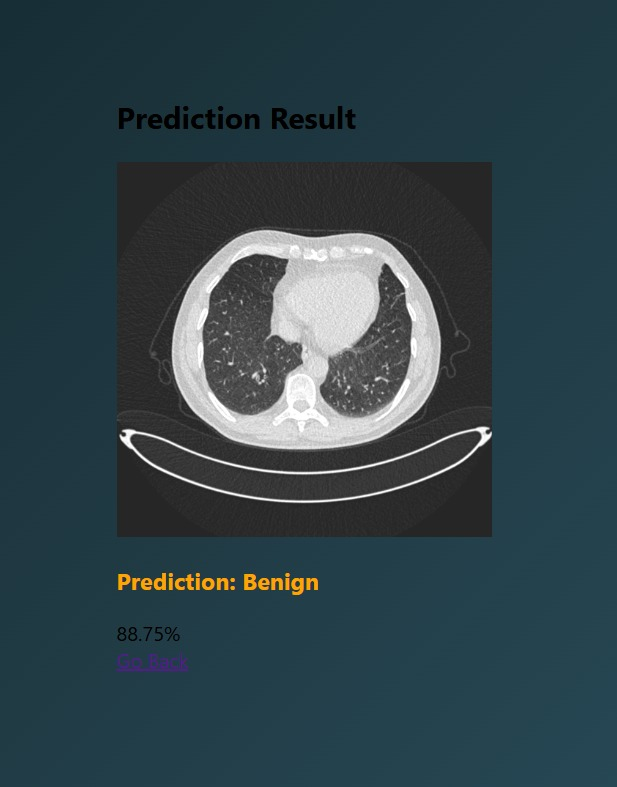
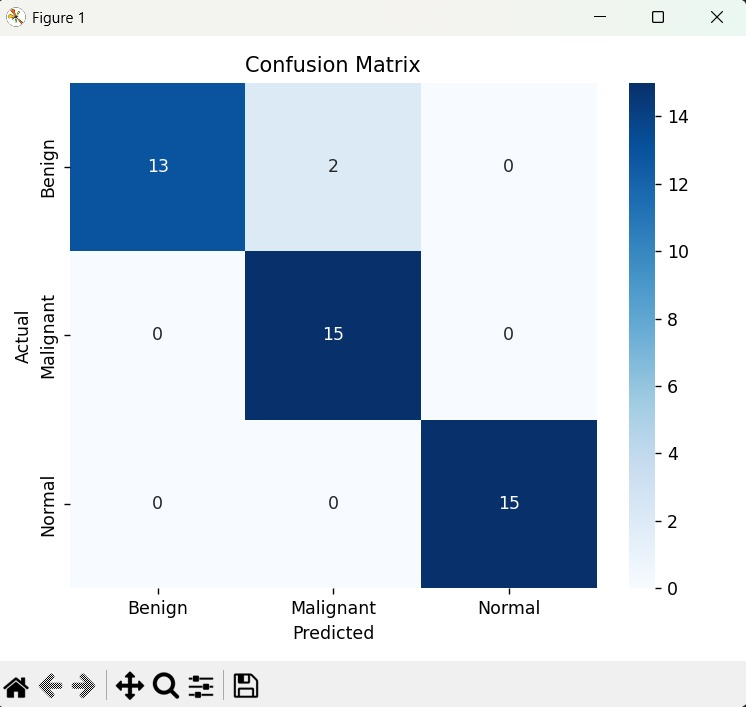

# 🫁 Lung Cancer Detection using GLCM + SVM

A Machine Learning based web application that detects **Benign, Malignant, and Normal** lung CT scan images using:

- Texture Feature Extraction (GLCM)
- Support Vector Machine (SVM)
- Flask Web Framework

## 🚀 Features

- Upload CT scan images
- Multi-class classification (Benign / Malignant / Normal)
- 95.56% Test Accuracy
- Confusion Matrix visualization
- Clean Medical UI
- Confidence Score display
- Model persistence with joblib

## 🧠 Model Details

- Feature Extraction: GLCM (multi-angle, multi-distance)
- Classifier: Linear SVM (Balanced)
- Preprocessing: Grayscale + Histogram Equalization
- Scaling: StandardScaler

## 📊 Performance

- Accuracy: **95.56%**
- Balanced Class Recall
- Improved Generalization

## 🏗 Project Structure

Lung_Cancer_Detection/
│
├── dataset/
│ ├── train/
│ ├── test/
│
├── src/
│ ├── preprocess.py
│ ├── feature_extraction.py
│ ├── train_model.py
│
├── templates/
├── static/
├── model/
├── app.py
├── requirements.txt
└── README.md

## ⚙️ How to Run

1. Clone repository
git clone https://github.com/sricharanadontula/Lung-Cancer-Detection-GLCM-SVM.git

2. Create virtual environment
python -m venv .venv

3. Activate environment
..venv\Scripts\activate

4. Install dependencies
pip install -r requirements.txt

5. Train model
python -m src.train_model

6. Run application
python app.py

Open:
http://127.0.0.1:5000

## 📸 Screenshots

### 🔹 Model Output 1

### 🔹 Model Output 2

### 🔹 Confusion Matrix

## 🎓 Applications

- Early lung cancer screening
- Medical AI research
- Computer Vision healthcare systems

## 👨‍💻 Author

Sricharana Dontula  
B.Tech CSE (AI & ML)

⭐ If you found this useful, consider giving a star!
